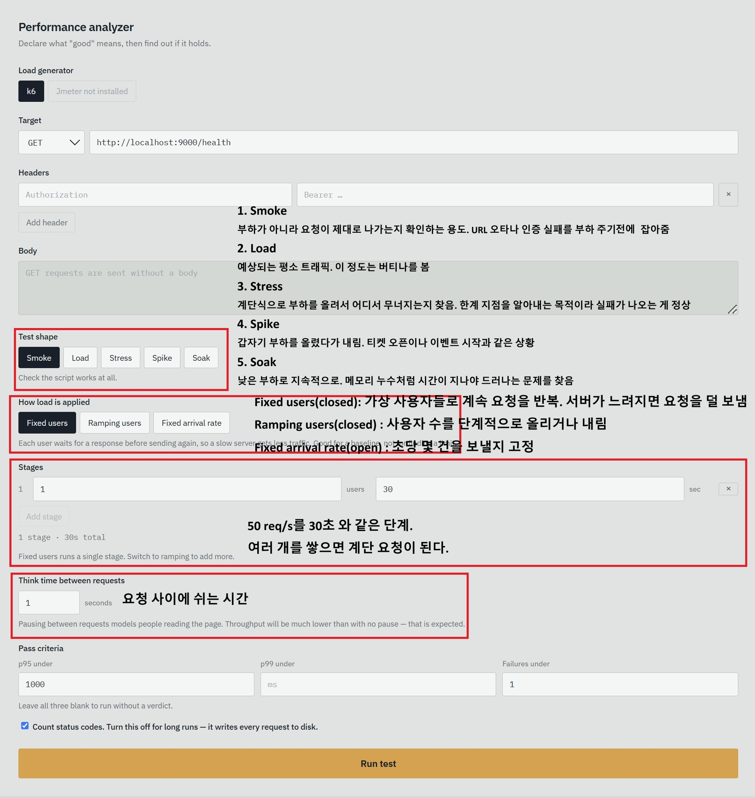
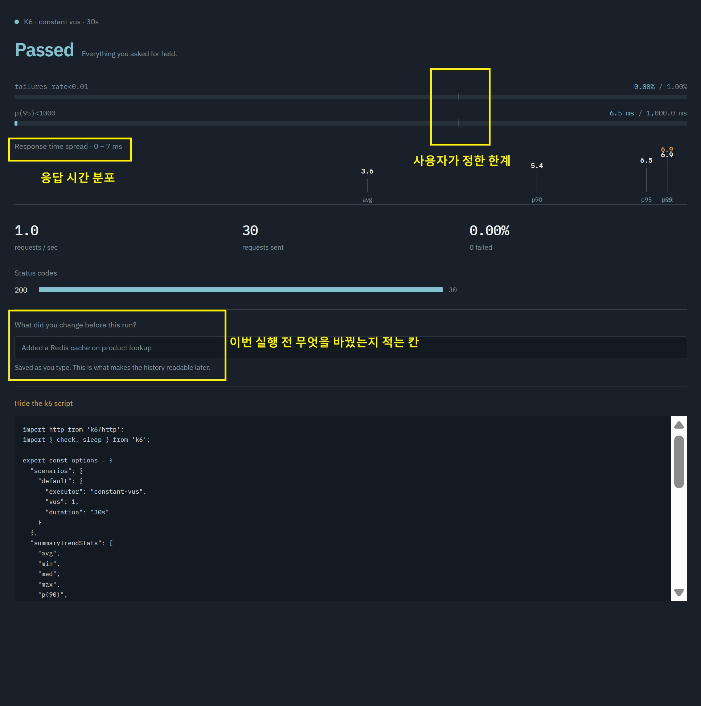

# Performance analyzer

k6를 래핑해 부하테스트 조건과 결과를 한 덩어리로 기록하는 로컬 도구.

부하테스트를 반복하다 보면 "이 숫자가 어떤 설정이었지"를 계속 잃어버린다.
조건, 결과, 그리고 이번에 무엇을 바꿨는지를 항상 같이 저장하는 것이 목적이다.

## 실행

k6가 설치돼 있어야 한다. 파이썬 패키지가 아니라 별도 바이너리다.

```bash
brew install k6      # macOS
winget install k6    # Windows
k6 version           # 확인
```

```bash
python -m venv .venv
```

```bash
source .venv/bin/activate      # macOS / Linux
.venv\Scripts\Activate.ps1     # Windows PowerShell
.venv\Scripts\activate.bat     # Windows cmd
```

```bash
pip install -r requirements.txt
uvicorn app.main:app --port 9000
```

http://localhost:9000 을 열면 UI가 뜬다. API 문서는 `/docs`.

## 설정



## 결과



p95는 "100번 중 95번은 이 시간 안에 응답했다"는 뜻이다.
평균만 보면 느린 요청을 놓치므로 p95와 max를 함께 본다.

## 이력

실행 결과는 `~/.performance-analyzer/runs/` 에 JSON으로 쌓인다.
서버를 껐다 켜도 남으며, `ANALYZER_HISTORY_DIR` 로 위치를 바꿀 수 있다.
하단 목록에서 두 건을 고르면 처리량·p95·실패율의 변화율을 비교한다.

## API

| Method | Path | |
|---|---|---|
| GET | `/api/v1/tools` | 설치된 부하 생성기 |
| POST | `/api/v1/tests` | 실행. 결과는 자동 저장 |
| GET | `/api/v1/runs` | 이력 목록 |
| GET | `/api/v1/runs/{id}` | 조건 + 결과 전체 |
| PATCH | `/api/v1/runs/{id}` | 변경 메모 수정 |
| DELETE | `/api/v1/runs/{id}` | 삭제 |